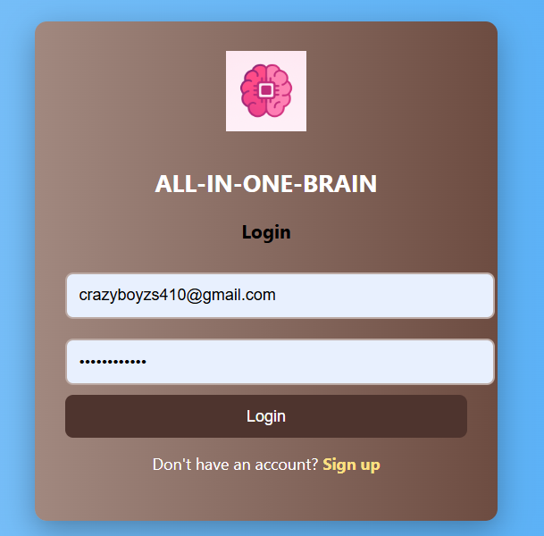
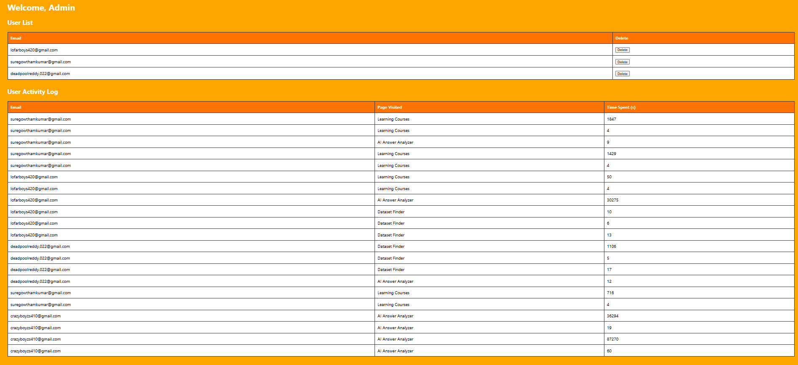
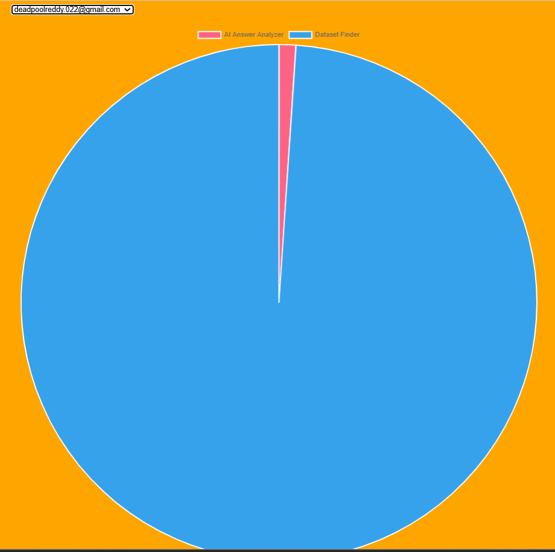

# 🧠 ALL-IN-ONE-BRAIN

**ALL-IN-ONE-BRAIN** is a web-based AI-powered hub that provides a seamless user experience to explore three core functionalities:
1. AI Answer Analyzer
2. Learning Courses
3. Dataset Finder

This platform is designed to help users get the most out of AI tools, curated educational resources, and public datasets — all under one login system powered by secure email-based OTP authentication.


## 🔐 Features

### 🔑 Secure Login via Email OTP
- Users authenticate using their email.
- A One-Time Password (OTP) is sent to the provided email for secure login.
- Once authenticated, users are redirected to the dashboard.

### 🧭 Dashboard with 3 Main Options
After successful login, users can choose from:
- **AI Answer Analyzer**: Analyze and compare answers from different AI models.
- **Learning Courses**: Explore categorized and curated learning content.
- **Dataset Finder**: Find datasets related to any topic, suitable for projects, research, and ML training.

### 👤 User Session Analytics (Admin Panel)
- Admin can monitor each user's activity.
- Time tracking for each feature (Analyzer, Courses, Finder).
- Session data is visualized in analytics charts.
- Admin can generate usage reports on demand.


## 🖼️ Screenshots

### 🔐 Login Page


### 🧠 Main Dashboard


### 📊 User Analytics (Admin View)


### 📊 PIE Analytics (Admin View)



## 🚀 How to Run Locally

1. **Clone the Repository**
```bash
git clone https://github.com/your-username/all-in-one-brain.git
cd all-in-one-brain
